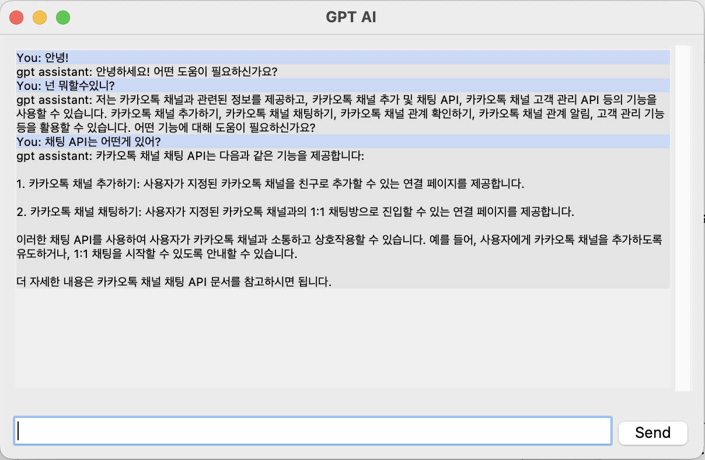

# kakao aicoursework

## env

```
$ brew install tcl-tk
$ brew install python-tk

$ pip install --upgrade pip
$ pip install 'urllib3<2.0'
$ pyenv uninstall 3.11.4
$ env \
  PATH="$(brew --prefix tcl-tk)/bin:$PATH" \
  LDFLAGS="-L$(brew --prefix tcl-tk)/lib" \
  CPPFLAGS="-I$(brew --prefix tcl-tk)/include" \
  PKG_CONFIG_PATH="$(brew --prefix tcl-tk)/lib/pkgconfig" \
  CFLAGS="-I$(brew --prefix tcl-tk)/include" \
  PYTHON_CONFIGURE_OPTS="--with-tcltk-includes='-I$(brew --prefix tcl-tk)/include' --with-tcltk-libs='-L$(brew --prefix tcl-tk)/lib -ltcl8.6 -ltk8.6'" \
  pyenv install 3.11.4
  
# ref : https://stackoverflow.com/questions/60469202/unable-to-install-tkinter-with-pyenv-pythons-on-macos
```

## 1번 과제

로컬의 source 파일을 기반으로 해서 function call을 할 수 있는 기반을 만들고,
적용되어있는 톡채널 정보를 응답하는 봇을 만든다.
</img>